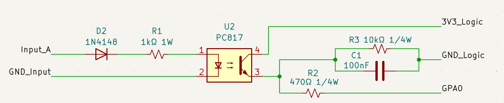
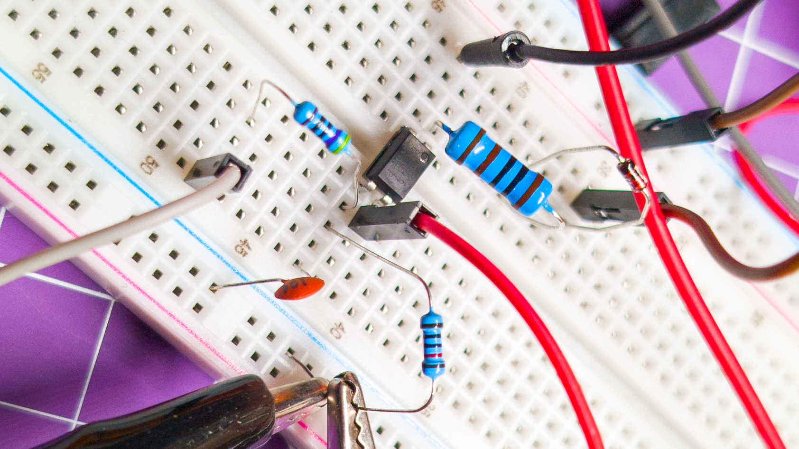
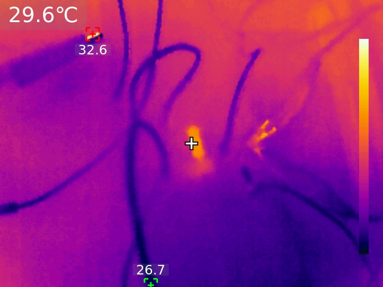
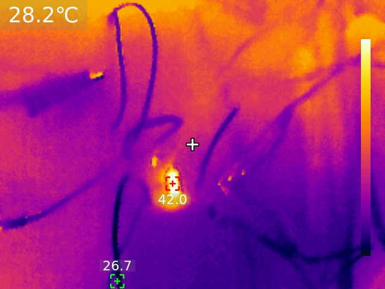
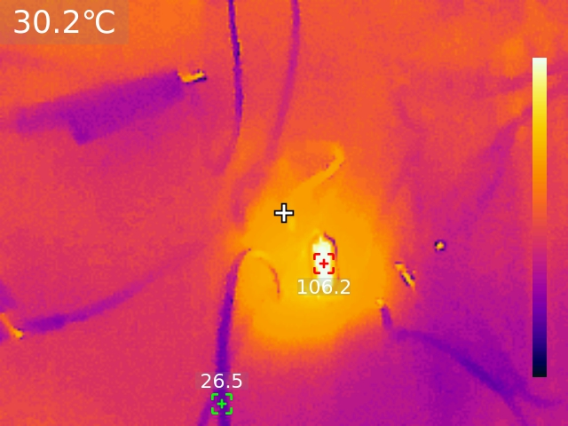

# Architecture

Tracking document for the architectural decisions on ORP.

## Configuration

Section currently empty

## I/O Architecture

### Input

Input stage has been prototyped and bench tested.

#### Features

Designed to allow for a wide input range (2V-24V) and enough protection to ensure that the microcontroller will be shielded against less-than-perfect electrical situations.

- 1N4148 diode
  - Protects from reverse polarity, preventing pulling current backwards through the PC817
  - can handle up to 100V peak reverse voltage, 75V continuous
  - can handle 500mA surge current, 300mA constant current
  - current is designed to stay low, the 1N4148 has lots of headroom, able to handle 440mW constant and 500mW peak dissipation power

- 1W 1kΩ resistor
  - limits current and should allow any input between 2V and 24V to safely turn on the optocoupler diode
  - at 2V, limits current to 0.002A maximum, consumes ~0.0016W
  - at 5V, limits current to 0.005A maximum, consumes ~0.019W
  - at 12V, limits current to 0.012A maximum, consumes ~0.13W
  - at 24V, limits current to 0.024A maximum, consumes ~0.53W

- PC817 optocoupler
  - ubiquitous and inexpensive way to completely isolate the input from the logic
  - 5kV of isolation
  - only 1.2V - 1.4V needed to start conducting and at very low current

- 470Ω 1/4W resistor
  - series resistor to protect the input pins of the MCP23017
  - should never be needed, but it is such cheap insurance that it makes sense to add

- 10kΩ 1/4W resistor and 100nF capacitor
  - debouncing to ensure a clean input signal

#### TEST RESULTS

The circuit has been breadboarded and tested, here are the testing notes:

##### Minimum input voltage

The minimum input voltage needed to generate a logic HIGH on the MCP23017 (~1.65V) has been tested at 1.88V, fulfilling the requirement of a minimum input voltage of 2V.
- Note that in the future it would be nice to get down to a minimum input voltage of 1.2V (NIMH AA/AAA cell) but for now, 2V minimum is a more than respectable figure.

##### Dissipation test on 1kΩ resistor

no dissipation test at 2V - negligeable dissipation

- 3V on input outputs the full 3.2V - resistor read room temp
  - 0.001A 0.003W

- 5V on input
  - 0.003A 0.015W 29C on resistor
  - 

- 12V on input
  - 0.01A 0.12W 48.1C on resistor
  - 

- 24V on input
  - 0.022A 0.528W 106.2C on resistor
  - 

Resistor seems to be good to work up to 155C - but would burn to the touch at that temp

PC817 absolute maximum current of 50mA is well respected
1N4148 continuous maximum current of 200mA is well respected

## Communication

Section currently empty

## Decision Log

Section currently empty

## Surprising Discoveries

Section currently empty